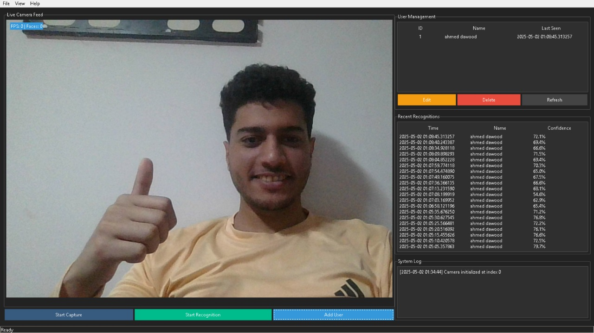

# 👤 Face Recognition Pro System

 <!-- Replace with actual screenshot -->

A powerful face recognition application with real-time detection, user management, and customizable settings.

## ✨ Features

| Feature | Status |
|---------|--------|
| ✅ Real-time face detection | Implemented |
| ✅ Face recognition | Implemented |
| ✅ User management | Implemented |
| ✅ Multiple themes | Implemented |
| 📊 Recognition history | In Progress |
| 📁 Data import/export | Planned |

## 🛠️ Tech Stack

- Python 3.8+
- OpenCV (cv2)
- face-recognition
- Tkinter (ttkbootstrap)
- SQLite3
- Pillow (PIL)

## 📂 Project Structure


```plaintext
face-recognition-app/
│
├── dataset/                  # User data storage
│   ├── config.pkl            # Application configuration
│   ├── face_recognition_v2.db # SQLite database
│   └── known_faces_v2.pkl    # Face encodings
│
├── src/                      # Source code
│   └── app.py                # Main application
│
├── requirements.txt          # Dependencies
├── README.md                 # Documentation
└── LICENSE                   # MIT License


## 🚀 Getting Started

### Prerequisites

- Python 3.8 or higher
- Webcam
- Git (optional)

### Installation

1. Clone the repository:
```bash
git clone https://github.com/Ahmed230460/Face-Recognition-App.git
cd Face-Recognition-App

   
